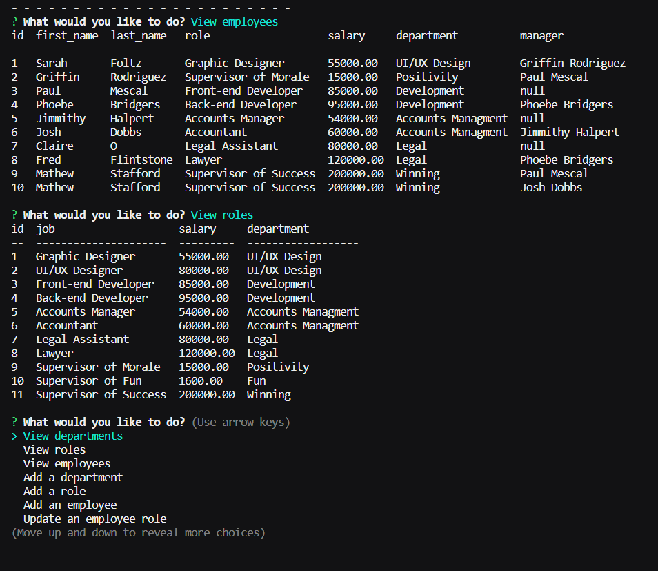

# Employee-Tracker


## About

This program allows the input and storage of a companies employees, roles, departments and managers. You can edit and view these employees roles at any point.

## Table of Contents

* [Made-With](#Made-with)
* [Install](#Install)
* [Video](#Video)
* [Screenshots](#Screenshots)
* [Liscense](#Liscense)
* [Credits](#Contact)

## Made-With 

* SQL
* MySQL
* Node.Js
* ES6

## Install

Start off by cloning the repository and opening it in VSCode. In your repos root directory, open the terminal and run ``` npm i ```. Once you have all of the dependencies installed you'll need to run ``` mysql -u root -p ``` and insert your password. Now in this mysql menu, you will need to create a new database by inputing ``` create database employee_db; ``` into your console. Once ran, input these commands below.

* ``` use employee_db ```
* ``` source db/db.sql ```
* ``` source db/schema.sql ```
* ``` source db/seeds.sql ```

Once completed, open a terminal in your repo and enter ``` npm start ``` to begin.

## Video

https://drive.google.com/file/d/1GEv-1X8HyiyTZr3slnebWduE5iiAemTJ/view

## Screenshots 



## Liscense

 This project is liscensed under the MIT liscense.
 
## Contact
Please email me at andrew@creativeaero.space if you have any questions